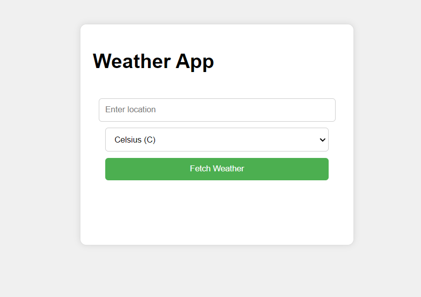
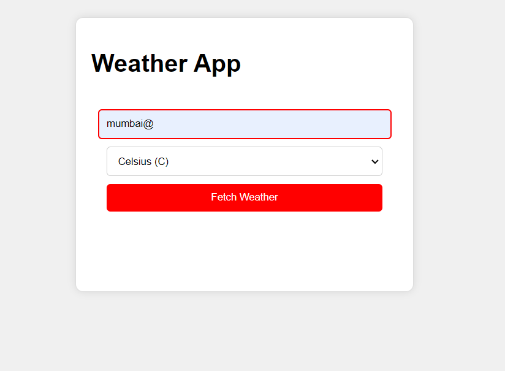
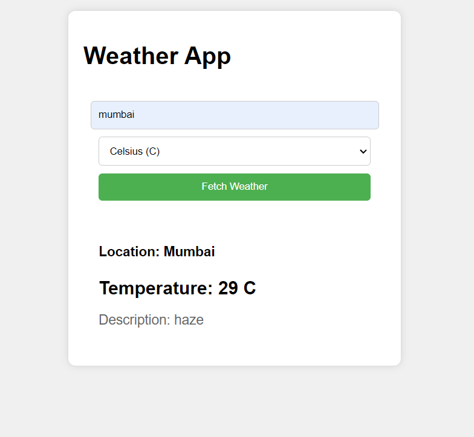
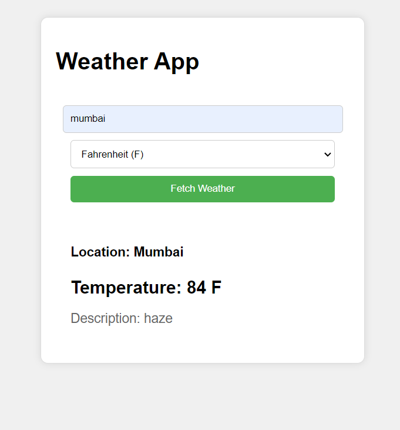

**Weather App**

A simple web application built with HTML, CSS, and pure JavaScript that provides current weather conditions for user-input locations.

**Features**

- User input for location
- Real-time weather data from Open Weather API
- Choose unit system (metric or imperial)
- Input validation to prevent invalid location entries
- Responsive design for mobile and desktop devices

**Screenshots**
(./images/screenshot.png)

**Requirements**

- Web browser
- Internet connection
- Open Weather API key (free tier available)

**Installation**

1. Clone the repository.
2. Replace YOUR_API_KEY with your Open Weather API key in script.js.
3. Open index.html in a web browser.

**Usage**

1. Enter a valid location in the input field.
2. Select the unit from dropdown menu (Celsius(default) or Fahrenheit).
3. Click the "Fetch Weather" button.
4. View current weather conditions.

**Technologies Used**

- HTML5
- CSS3
- JavaScript (ES6+)
- Open Weather API

**Contributing**

Pull requests and issues welcome.

**Author**

**_Shivam Tiwari_**

